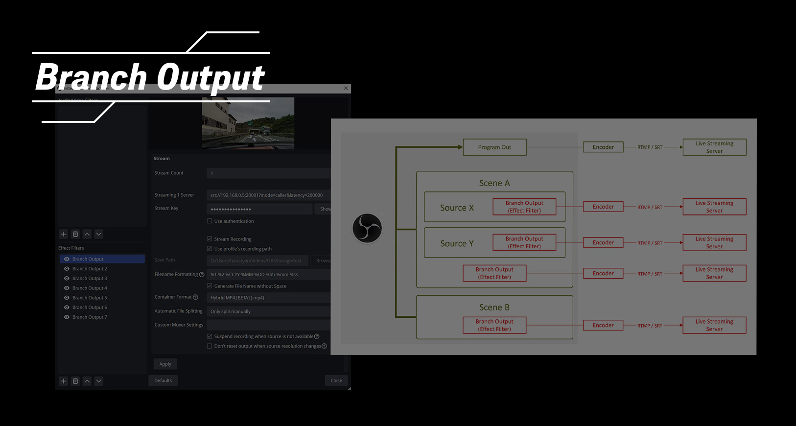
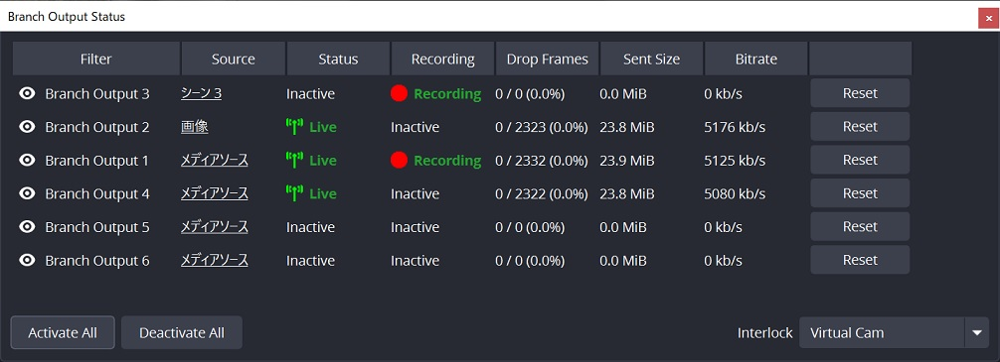

# Branch Output filter (The OBS Studio Plugin)

[日本語はこちら](./README_ja.md)

> ## Sponsor program
> 
> If you would like to help our projects, please support us.
>
> 

## Features

This is an OBS Studio plugin that allows to live stream and/or recording for each source individually.
Inspired by the [Source Record](https://github.com/exeldro/obs-source-record) plugin, but more focused on streaming.
More reliable and proper audio handling.

- Added “Branch Output” to source or scene effect filters.
- One stream per Branch Output filter can be sent with dedicated encoding settings.
- Multiple Branch Outputs can be added to a single source or scene (as PC specs allow)
- Branch Output Selectable audio source for each filter (filter audio, any source audio, audio tracks 1-6)
- Automatically reconnects when disconnected
- Stream recording functionality (Various container formats, time and size division supported)
  
  (*) Works as recording only if connection information is left blank
  
- Status dock to check the status and statistics of all Branch Output filters. Support for batch or individual activation and deactivation
- Can be interlinked with OBS Studio's streaming, recording, virtual camera, and replay buffer status
- Manual splitting of recorded files (Since 1.0.5)
- Pause/Unpause Recording (Since 1.0.5)
- Adding chapter markers to recordings（Only on Hybrid MP4） (Since 1.0.5)
- Replay buffer per filter (Since 1.0.8)
- Filter input mode to capture and output video from the filter chain (Experimental, Since 1.0.8)
- Blanking and muting when the source is not visible in the program output (Since 1.0.8)
- Per-profile Status Dock settings (Since 1.0.8)
- Various hotkeys
  - Enable/Disable the filter
  - Manual recording splitting, Pause/Unpause, Adding chapters (Since 1.0.5)
  - Enable/Disable all
  - Split all recordings, Pause/Unpause all recordings, Add chapter to all reacordings (Since 1.0.5)
  - Save replay buffer, Save all replay buffers (Since 1.0.8)
- Also available in Studio Mode
  - **Branch Output ignore studio mode's program out and always outputs preview's one**

## Requirements

[OBS Studio](https://obsproject.com/) >= 30.1.0 (Qt6, x64/ARM64/AppleSilicon)

# Installation

Please download latest install package from [Release](https://github.com/OPENSPHERE-Inc/branch-output/releases)

# User manual

1. Add "Branch Output" as effect filters to any "Source" or "Scene" (NOTE: "Scene" has no audio defaultly)
2. Input server URL and stream key. The server URL can be RTMP or SRT etc. like OBS's custom stream settings.
3. Choose audio source. Un-checked custom audio source means use filter audio as source (NOTE: "Scene"
   must has custom audio source for it's sound)

   "Any Sources" will be captured after filter pipeline before Audio Mixer. Also "Audio track 1 ~ 6" will be captured from Audio Mixer output.  
   
   You can choose "No Audio" as well.  
   
4. Setup audio and video encoder. It's usable that hardware encoder such as NVENC.
5. Press Apply button and stream will be online.
6. When filter is inactivated via "Eye icon", output stream will be offline too.

(*) Some sources (e.g. Local Media source) will stop stream output during inactivated scene. It's not plugin's bug.

# TIPS

## 1. To change the resolution and layout for streaming (Work-around)

> Changing Resolution feature is integrated since 1.0.0
> 
> Below steps are alternative method with more flexibilities (Cropping, Zooming, Adding black bg etc...)

1. The canvas resolution is assumed to be 1080p.
2. Create new blank scene.
3. Right-click on the source you want to stream and click “Copy” from the menu.
4. Right-click on the blank scene created in step 2 and click “Paste (Reference)” from the menu.
   Scale and crop as needed.
5. Add Branch Output to the scene's effects filter and set up streaming

“Paste (Reference)” does not duplicate the source and will not cause device conflicts.

Branch Output will stream even if the scene is not active.

This method should work well except for some sources (e.g., media sources) that will not play unless the scene is active.

## 2. To stream program out to multiple streaming platforms.

> **Important note**: Work in studio mode to prevent video loops.

This can be done by using the plugin [Main View Source](https://obsproject.com/forum/resources/main-view-source.1501/) along with it.

1. Create new blank scene (The scene for streaming)
2. Add a “Main View Source” to the scene for streaming.
3. Add Branch Output to the scene's effects filter and set up streaming.

You can also create multiple scenes for streaming and layer additional sources to change the content for each streaming platform.

For example, you might want to display Twitch comments on Twitch and YouTube comments on YouTube.

However, this method adds sources but does not reduce them.

# Development

This plugin is developed under [obs-plugintemplate](https://github.com/obsproject/obs-plugintemplate)

