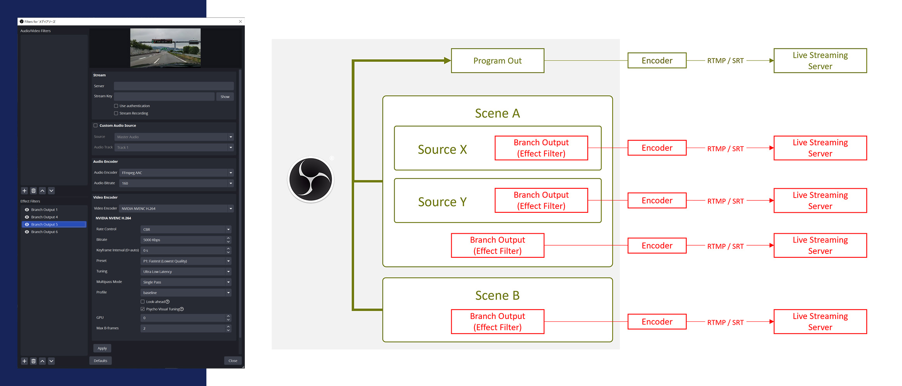

# Branch Output filter (The OBS Studio Plugin)

## Features

**[EN]**

This is an OBS Studio plugin that allows to live stream and/or recording for each source individually.
Inspired by the [Source Record](https://github.com/exeldro/obs-source-record) plugin, but more focused on streaming.
More reliable and proper audio handling.

- Added “Branch Output” to source or scene effect filters.
- One stream per Branch Output filter can be sent with dedicated encoding settings.
- Multiple Branch Outputs can be added to a single source or scene (as PC specs allow)
- Branch Output Selectable audio source for each filter (filter audio, any source audio, audio tracks 1-6)
- Automatically reconnects when disconnected
- Stream recording functionality (Various container formats, time and size division supported)
  
  (*) Works as recording only if connection information is left blank
  
- Status dock to check the status and statistics of all Branch Output filters. Support for batch or individual activation and deactivation
- Can be interlinked with OBS Studio's streaming, recording, and virtual camera status

> **For studio mode: Branch Output ignore studio mode's program out and always outputs preview's one**

**[JP]**

この OBS Studio プラグインでは、ソース毎に配信ないし録画するエフェクトフィルタを追加します。
[Source Record](https://github.com/exeldro/obs-source-record) プラグインに触発されて開発しましたが、ストリーミングでの使用に重点が置かれています。
より信頼性があり、適切なオーディオの取り扱いを行います。

- ソースまたはシーンのエフェクトフィルタに「Branch Output」を追加
- フィルター1つにつき1本のストリーム送出が、専用のエンコーディング設定で可能
- 1つのソース・シーンに複数の Branch Output を追加可能（PCのスペックが許す限り追加可能）
- Branch Output フィルターごとに音声ソースを選択可能（フィルター音声、任意ソース音声、音声トラック1～6）
- 接続が切れても自動的に再接続
- 配信録画機能（各種コンテナ形式、時間・サイズ分割に対応）
  
  ※接続情報を空欄にすれば録画のみとして動作

- ステータスドックで全 Branch Output フィルターの状態と統計を確認可能。一括ないし個別の有効化・無効化に対応。
- OBS Studio の配信・録画・仮想カメラの状態と連動可能

> **スタジオモード向け: Branch Output はスタジオモードのプログラム出力を無視し、常にプレビューを出力に使用します**

## Requirements

[OBS Studio](https://obsproject.com/) >= 30.1.0 (Qt6, x64/ARM64/AppleSilicon)

# Installation

Please download latest install package from [Release](https://github.com/OPENSPHERE-Inc/branch-output/releases)

# User manual

**[EN]**

1. Add "Branch Output" as effect filters to any "Source" or "Scene" (NOTE: "Scene" has no audio defaultly)
2. Input server URL and stream key. The server URL can be RTMP or SRT etc. like OBS's custom stream settings.
3. Choose audio source. Un-checked custom audio source means use filter audio as source (NOTE: "Scene"
   must has custom audio source for it's sound)

   "Any Sources" will be captured after filter pipeline before Audio Mixer. Also "Audio track 1 ~ 6" will be captured from Audio Mixer output.  
   
   You can choose "No Audio" as well.  
   
4. Setup audio and video encoder. It's usable that hardware encoder such as NVENC.
5. Press Apply button and stream will be online.
6. When filter is inactivated via "Eye icon", output stream will be offline too.

(*) Some sources (e.g. Local Media source) will stop stream output during inactivated scene. It's not plugin's bug.

**[JP]**

[こちらのブログ記事](https://blog.opensphere.co.jp/posts/branchoutput001) に日本語でより詳しい使い方を掲載していますので参照ください。

1. 任意の「ソース」または「シーン」に、エフェクトフィルタとして "Branch Output" を追加
   （注意：「シーン」はデフォルトでオーディオがありません）
2. サーバーURLとストリームキーを入力。
   サーバーURLは OBS のカスタム配信設定の様に RTMP や SRT 等を使用できます。
3. オーディオソースを選択。
   カスタムオーディオソースからチェックを外した場合、フィルターオーディオを使用します
   （注意：「シーン」の音声は必ずカスタムオーディオソースを使用しなければなりません）

   「任意のソース」はフィルターパイプラインの後、オーディオミキサーの前で取り込まれます。
   「音声トラック1～6」はオーディオミキサーの出力が取り込まれます。

   「無音」も選択可能です。
4. 音声および映像エンコーダーを設定。NVENC 等のハードウェアエンコーダーも使用可能です。
5. 「適用」ボタンをクリックすると、送信が開始されます。
6. 「目」アイコンでフィルターが非アクティブ化されると、出力ストリームもオフラインになります。

※いくつかのソース（例：ローカルメディアソース）は、シーンが非アクティブの場合に送出が停止しますが、これはプラグインのバグではありません。

# Development

This plugin is developed under [obs-plugintemplate](https://github.com/obsproject/obs-plugintemplate)

